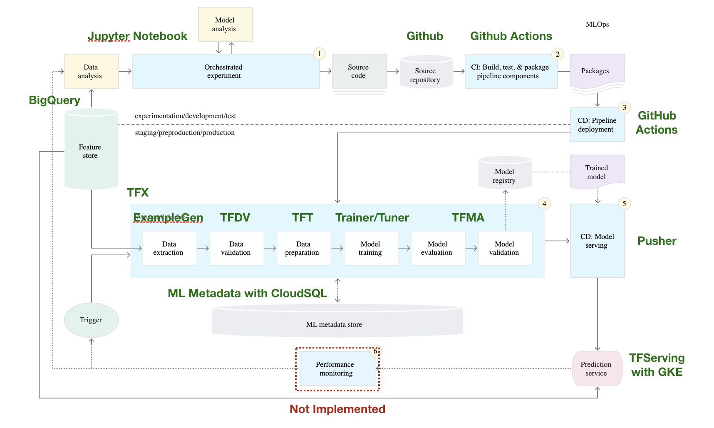
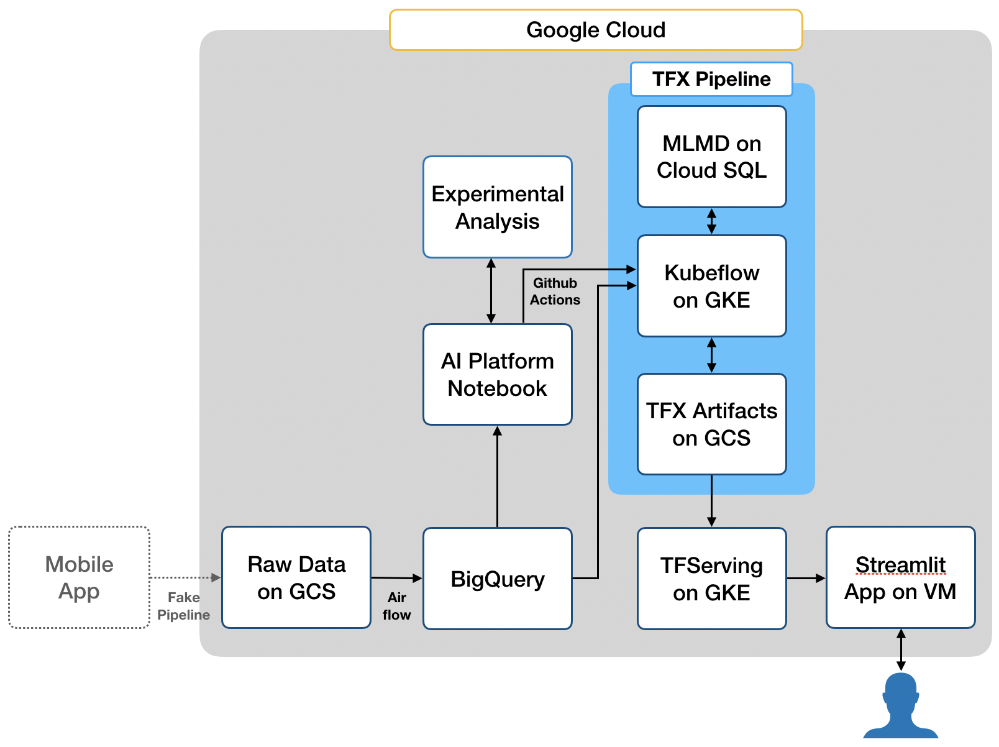

# MLOps Demo

## 개요

MLOps Demo repository는 분석 주제별 production 레벨의 머신러닝 시스템 코드를 포함하고 있습니다. Google MLOps Level 2 기준의 머신러닝 시스템 구현을 목표로 합니다. 
구글 클라우드 기반으로 TFX와 Kubeflow를 이용해 개발을 진행하고 있습니다. 현재 기준으로 performance monitoring 부분을 제외하고 간단한 코드들로 Level 2 기준의 시스템을 구현했습니다. 프로젝트는 Zenhub와 Git Flow 브랜치 전략을 사용해 진행했습니다. 일부 모듈에 대해서는 추가적인 고도화 및 테스트가 필요합니다.  

[그림 1] MLOps Level 2 기준에서 구현된 부분 하이라이트
(https://cloud.google.com/architecture/mlops-continuous-delivery-and-automation-pipelines-in-machine-learning?hl=ko)

## 기술 요소

### Orchestration
- Kubeflow (1.7.1)
- Airflow (2.3.0)
- Github Actions

### Compute
- Google Kubernetes Engine: Pipeline cluster와 tfserving 인프라로 활용 
- Compute Engine VMs (Container-Optimized OS): streamlit app 배포에 활용 

### ML Pipeline
- TFX (1.7.1)

### ML Experiments Environment
- Google Cloud AI platfrom notebook

### Database & Datawarehouse
- CloudSQL (MySQL 5.7): Managed mlmd metadaata store로 활용
- BigQuery: raw 데이터가 적재된 분석 데이터웨어하우스로 활용

### Storage
- Cloud Storage

### Front-end
- Streamlit (1.9.0): 데모 dashboard UI 구현에 활용

### Version Control & Container Registry
- Git (2.20.1)
- Google Container Registry

## 시스템 구성

[그림 2] 구현된 MLOps 시스템 도식화 

모바일 앱으로부터 GCS로 데이터가 적재되는 파이프라인이 있다고 가정하고 GCS를 원천으로 머신러닝 시스템을 만드는 케이스를 가정했습니다. 
- GCS의 원천데이터는 Airflow를 통해 BigQuery로 transfer 됩니다. 
- BigQuery를 분석 DW로 삼고 AI Platform 노트북 인스턴스에서 experimental 분석을 수행합니다. 
- 프로덕션용 머신러닝 모델은 TFX 파이프라인으로 구현되어 Github Action을 통해 테스트되고 배포됩니다. 
- GKE로 구성된 TFServing 서버에서 파이프라인에서 생성된 모델을 바탕으로 prediction 서비스를 제공합니다. 
- 사용자는 Steramlit으로 만들어진 데모 UI에서 모델을 이용할 수 있습니다.

## 프로젝트 구성 

### 주제

#### 광고 클릭 예측 (Binary Classification)
- advert_pipeline에 해당
- 전체적인 production machine learning 시스템 구성 테스트를 위한 주제
#### 나머지 주제 추후 업데이트 예정

### 주요 디렉토리 및 파일

#### `experiments/`: MLOps Level diagram 기준 experimentation/development/test 영역의 코드 포함
- `advert_experiment/`: 광고 클릭 예측 experiment 코드
- 추후 다른 주제의 파이프라인 빌드 이전의 experiment 코드를 포함할 예정
#### `pipelines/`: MLOps Level diagram 기준 staging/preproduction/production 영역의 코드 포함
- `advert_pipeline/`: 광고 클릭 예측 pipeline
   - `dashboard/`: streamlit을 활용한 광고 예측 데모 화면 구현 코드
   - `deployment/`: tfserving을 이용한 모델 serving 코드 (Single instance를 위한 Docker 이미지와 GKE를 위한 yaml 파일 포함)
   - `models/`: tfx trainer run_fn, tuner tuner_fn 등이 포함된 모델 코드
   - `orchestration/`: 주기적 데이터 수집을 위한 airflow 코드 (추가 테스트 필요, MLOps 이전 단계의 데이터 수집 단계 코드에 해당) 
   - `pipeline/`: tfx 파이프라인 코드
   - `schema/`: customzied된 schema 저장 디렉토리 
   - `utils/`: bigquery, kfp, serving, tfx 등에 관한 utils 모듈
   - `kubeflow_runner.py`: kubeflow를 이용해 일단위로 파이프라인을 recurring run 시킬 hyperparameter optimization이 없는 일반 학습 파이프라인
   - `kubeflow_runner_with_tunner.py`: kubeflow를 이용해 일주일에 한 번 파이프라인을 recurring run 시킬 hyperparameter optimization이 포함된 학습 파이프라인
   - `local_runner.py`: local test를 위한 hyperparameter optimization이 없는 일반 학습 파이프라인
   - `local_runner_with_tunner.py`: local test를 위한 hyperparameter optimization이 포함된 학습 파이프라인
   - `data_validation.ipynb`: 기본적으로 tfdv로 infer된 schema가 아닌 추가 customized된 schema 생성 위한 노트북 
 - 추후 다른 주제의 파이프라인 코드를 포함할 예정
#### `advert_main.ipynb`: kubeflow 파이프라인 생성, run/recurring run 생성 등 파이프라인 조작을 위한 코드 포함 (개발용 노트북)

### 기타 디렉토리 및 파일
#### `.github/workflows/`: Github Action CI/CD workflow 포함 (현재는 간단한 테스트 코드 실행 -> 파이프라인 빌드/업데이트 순으로 구현)
#### `sample/`: serving API 테스트를 위한 샘플 데이터 저장 디렉토리

## 향후계획

- BigQuery 오픈 데이터나 Kaggle 데이터를 활용한 다른 분석 주제에 대한 파이프라인 구성 (e.g. 추천, 문서 요약, 시계열 예측, 최적화 등)
- 주제에 맞는 TFX components 활용 고도화 
- CI/CD 고도화 및 performance monitoring 부분 추가